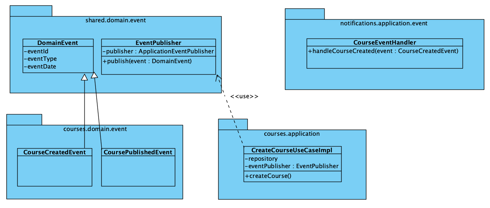

# Implementación de EDA

## Diagrama de clases


## Pruebas

### 1. Creación de curso
POST : http://localhost:8080/api/courses

```
{
  "title": "Spring Boot Masterclass - version 2",
  "description": "Learn Spring Boot from scratch",
  "instructor": "John Doe"
}

```

### 2. Publicar un curso

PUT : http://localhost:8080/api/courses/1/publish

Donde el ID del curso es 1